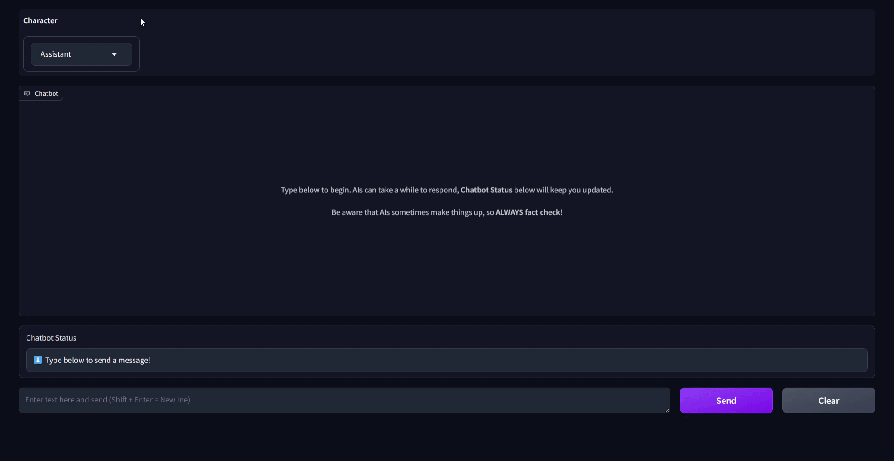

# Summary
Chat to various helpful uncensored characters from the privacy of your own computer. No data leaves your computer. Easy install and out-of-the-box usage. There will always be a free version with basic features. Other features may be added that require payment to support development of the app.

# Key features
* 🔒 Total privacy - no data is gathered on personal usage or to train models. All your conversations are temporary
* 🗽 Uncensored characters - chat about whatever you want with no restrictions (you're responsible for following any laws in your country)
* 🚀 Easy install and usage
* ↔️ Available on multiple platforms (Windows, macOS)

# Requirements
* Fast CPU with a minimum of 8GB RAM **or** GPU with a minimum of 8GB VRAM - fast enough for a 7 billion parameter model. If you're not sure, just give it a try - the worst that will happen is the characters will speak too slowly for your taste
* ~5GB disk space - the app is small, the models are the large part

# Demo
The below was run on an **NVIDIA GeForce RTX 3070 Ti** with **8GB VRAM** graphics card. Performance will vary based on your **GPU** or **CPU**.

# Built-in characters
* Assistant - general purpose
* Custom - provide whatever instructions you want
* Editor - writing specialist
* Life Coach - helps with personal goals
* Roleplay - another human to talk to
* Stay Positive - cheers you up

# Useful command line options
* `--device <cpu|gpu>` - force app to use either **cpu** or **gpu**. Default is to try **gpu**, then fallback to **cpu**
* `--enable-debug-mode` - enable file logs and output user / bot input and output text. Use this with caution since it will contain your conversations

# Known issues
In general, the app is bug free (please submit any issues via [robochum@outlook.com](mailto:robochum@outlook.com) or through [GitHub Issues](https://github.com/RoboChum/release/issues)). However:
* Alpha currently uses a self-signed cert. In addition the app is packaged into an executable which freaks out virus checkers. This combination of self-signed cert + compressed executable means your virus checker _may_ block the executable from running. Currently you'll have to trust me the app is safe while waiting for a proper code signing certificate
* Chatbot message window doesn't auto-scroll when messages appear (bug in 3rd party library, waiting on fix)

# Future releases
* More customisation options
* Voice input / output
* Image generation / sending
* Finer grained memory / privacy options
* API support for power users
* Remote access for power users
* Anything else based on user feedback 😁
